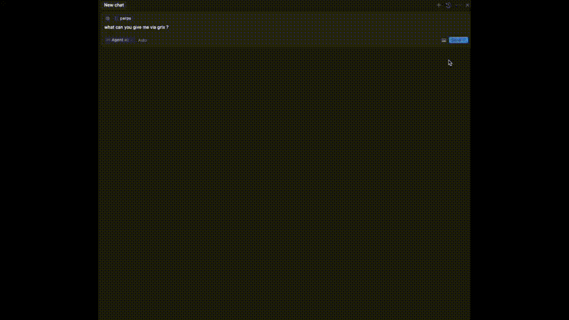

# Grix MCP (Model Context Protocol)

Grix is a powerful Derivatives Toolkits Marketplace designed for Agentic Trading, providing real-time options pricing data from various protocols and enabling the creation of sophisticated trading signals through AI agents.



## Features

-   Real-time options pricing data
-   AI-powered trading signal generation
-   Integration with multiple DeFi protocols
-   Advanced derivatives toolkit

## Prerequisites

Before you begin, ensure you have:

-   A Grix API key (obtain from [Grix App](https://app.grix.finance/api))

## Setup

1. Get your API key from the Grix platform:

    - Visit [https://app.grix.finance/api](https://app.grix.finance/api)
    - Generate your API key
 
2. Set up MCP configuration:
   Create or update your `~/.cursor/mcp.json`:
   
   Using npm:
    ```json
    {
    	"mcpServers": {
    		"GRIX": {
    			"command": "npm",	
    			"args": ["x", "@grixprotocol/grix_mcp"],
    			"env": {
    				"GRIX_API_KEY": "your_api_key_here"
    			}
    		}
    	}
    }
    ```
    
   Using pnpm:
    ```json
    {
    	"mcpServers": {
    		"GRIX": {
    			"command": "pnpm",	
    			"args": ["dlx", "@grixprotocol/grix_mcp"],
    			"env": {
    				"GRIX_API_KEY": "your_api_key_here"
    			}
    		}
    	}
    }
    ```

## Usage

Once configured, you'll have seamless access to all methods provided by the [Grix Protocol SDK](https://github.com/grixprotocol/sdk) through the MCP interface. This means you can directly use:

### Available SDK Methods

#### Asset and Option Price Methods
- Fetch real-time asset prices
- Get option price information
- Retrieve asset and option price history

#### Market Analysis Methods
- Generate AI-powered trading signals
- Analyze market data for insights
- Access DeFi protocol data (Hyperliquid, etc.)

#### Example Queries
- "Get current BTC price"
- "Show me option data for BTC calls"
- "Generate moderate growth trading strategies with a $5000 budget"
- "What are the predicted funding rates for Hyperliquid?"

All functionality from the Grix SDK repository is available through this MCP interface without requiring additional configuration.

> **Note:** The Grix SDK is continuously evolving with new features and capabilities being added regularly. The examples above represent just a sample of the available functionality. For the most up-to-date capabilities, refer to the [SDK repository](https://github.com/grixprotocol/sdk) or simply ask what's possible through the MCP interface.

## Support

For any questions or issues:

-   Join our [Telegram channel](https://t.me/grixfinance)
-   Join our [Discord community](https://discord.com/invite/ZgPpr9psqp)
